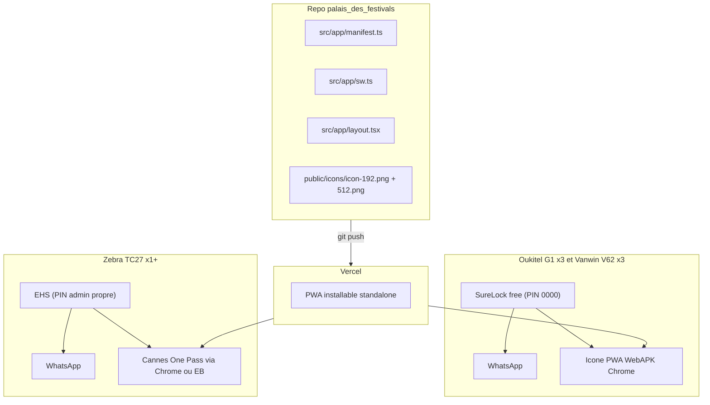

# Mode kiosque parc Android — runbook opérationnel

Ce dossier décrit comment configurer et exploiter le parc Android dédié à **Cannes One Pass** en mode kiosque verrouillé : 2 usages exclusifs (la PWA Cannes One Pass + WhatsApp), démarrage automatique, sortie par code admin uniquement.

| Documentation | Pour qui | Contenu |
|---|---|---|
| `README.md` (ce fichier) | Tous | Vue d'ensemble, politique de connexion, gestion des secrets, exploitation courante |
| [RUNBOOK_OUKITEL_VANWIN.md](RUNBOOK_OUKITEL_VANWIN.md) | Tech parc | Procédure SureLock free pour Oukitel G1 et Vanwin V62 |
| [RUNBOOK_ZEBRA_TC27.md](RUNBOOK_ZEBRA_TC27.md) | Tech parc | Procédure StageNow + EHS pour Zebra TC27 |
| [zebra/enterprisehomescreen.xml](zebra/enterprisehomescreen.xml) | Tech parc | Config EHS (PIN admin à remplir) |
| [zebra/stagenow_profile_README.md](zebra/stagenow_profile_README.md) | Tech parc | Construction et archivage du profil StageNow |
| [CHECKLIST_PILOTE.md](CHECKLIST_PILOTE.md) | Référent pilote | Validation à passer **avant** déploiement de masse |

---

## 1. Architecture cible

## 2. Choix techniques (et pourquoi)

| Décision | Choix | Raison |
|---|---|---|
| Empaquetage web | PWA installable (Serwist + manifest) | 0 €, déploiement instantané via Vercel push, pas de Play Store |
| Service worker | `@serwist/next` 9.x avec `defaultCache` | Maintenance active (vs `next-pwa` quasi-abandonné), `NetworkFirst` HTML par défaut limite les "vieilles versions" en cache |
| Launcher Oukitel/Vanwin | **SureLock free** | Limite 2 apps = pile notre besoin, gratuit, simple à déployer |
| PIN SureLock | `0000` (figé en gratuit) | Acceptable car parc encadré, parc privé, sortie admin contrôlée par tech |
| Launcher Zebra | **EHS + StageNow** | Écosystème Zebra gratuit, déploiement par barcode reproductible à l'infini |
| Code Zebra | PIN admin propre (renseigné dans `enterprisehomescreen.xml`) | Différent par environnement, stocké dans coffre |
| MDM central | **Aucun** pour démarrer | 7 devices = configuration manuelle plus rapide qu'un MDM. Évolutif vers Headwind self-hosted plus tard si parc grandit |

## 3. Politique de connexion utilisateur (kiosque pro)

> Objectif : **l'utilisateur final ne doit jamais voir l'écran de login en exploitation**.

3 niveaux empilés :

1. **Niveau simple** : autoriser Chrome à enregistrer le mot de passe pour la PWA lors de la préconnexion. Fonctionne car la PWA standalone hérite du gestionnaire de mots de passe Chrome sur Android.
2. **Niveau session longue** : côté serveur (`better-auth` configuré dans le repo), définir une session longue (~30 jours) avec cookie sécurisé HttpOnly. À ajuster dans la config `better-auth` selon politique sécurité interne.
3. **Niveau préconnexion device** : à la mise en service, le tech connecte une fois le device avec les identifiants utilisateur dédiés à cet appareil. Le device est ensuite verrouillé : tant que la session reste valide, plus aucune saisie.

### Stratégie incident session

- **Si la session expire en exploitation** :
  1. Tech : sortie admin (5 taps + PIN sur SureLock, ou tap titre + PIN sur EHS).
  2. Tech : ouvrir la PWA, se reconnecter avec les identifiants du device (récupérés du coffre).
  3. Tech : rebascule en mode kiosque.
- **Vérification mensuelle** : brancher chaque device, vérifier que la PWA est connectée et que l'app fonctionne (cf. checklist pilote). Renouveler les sessions si nécessaire.

### Identifiants utilisateur dédiés par device

> **Recommandé** : un compte utilisateur Cannes One Pass **par device**, pas un compte personnel d'agent.
>
> Avantages : traçabilité par appareil, possibilité de révoquer un device sans toucher aux comptes humains, auditabilité.

À documenter dans le tableau de suivi (cf. § 6).

## 4. Gestion des secrets (règles non-négociables)

| Secret | Stockage autorisé | Stockage interdit |
|---|---|---|
| PIN SureLock (`0000` figé en gratuit) | Coffre (Bitwarden/KeePass) | Aucun fichier visible sur le device |
| PIN admin EHS (TC27) | Coffre | Le `enterprisehomescreen.xml` est stocké dans le coffre, pas dans le device en clair |
| Mot de passe StageNow Administrator | Coffre, **avec note "non récupérable"** | Email, post-it, fichier en clair |
| Compte Google "jetable" du parc | Coffre, accès tech parc uniquement | Partagé avec utilisateurs finaux |
| Identifiants utilisateur Cannes One Pass par device | Coffre, lié au tableau de suivi | Pas en clair sur l'appareil (laisser Chrome les enregistrer dans le keystore Android est OK) |
| Mots de passe Wi-Fi prod | Coffre, profil StageNow | Pas en clair dans un README accessible publiquement |

> **Coffre recommandé** : Bitwarden (cloud, gratuit, ouvert, équipe possible) ou KeePass (offline, fichier `.kdbx` sur cloud entreprise).

## 5. Déploiement — ordre de bataille

> Avant tout déploiement de masse, dérouler la [CHECKLIST_PILOTE.md](CHECKLIST_PILOTE.md).

| Étape | Durée | Action |
|---|---|---|
| 1 | ~1 h | Code PWA déjà mergé + déployé sur Vercel. Validation Chrome desktop : icône "Installer" présente |
| 2 | ~30 min | Pilote Oukitel G1 → tests checklist |
| 3 | ~30 min | Pilote Vanwin V62 → tests checklist |
| 4 | Go/No-Go | Si tout vert : déploiement masse |
| 5 | ~2-3 h | Cloner sur 2 G1 + 2 V62 restants (~30 min/device) |
| 6 | ~2-3 h | Pilote Zebra TC27 (création profil StageNow + staging) |
| 7 | ~1 h | Documentation finale + passation au tech parc + remplissage du tableau de suivi |

## 6. Tableau de suivi du parc (à tenir à jour)

> À maintenir dans le coffre (ou un Notion/Google Sheet privé).

| ID | Modèle | N° de série | N° WhatsApp | Compte Google | Identifiants OnePass | PIN écran | Date MEP | Référent |
|---|---|---|---|---|---|---|---|---|
| OK-G1-01 | Oukitel G1 | _à remplir_ | _à remplir_ | parc | _à remplir_ | _à remplir_ | _à remplir_ | _à remplir_ |
| OK-G1-02 | Oukitel G1 | … | … | … | … | … | … | … |
| OK-G1-03 | Oukitel G1 | … | … | … | … | … | … | … |
| VW-V62-01 | Vanwin V62 | … | … | … | … | … | … | … |
| VW-V62-02 | Vanwin V62 | … | … | … | … | … | … | … |
| VW-V62-03 | Vanwin V62 | … | … | … | … | … | … | … |
| ZB-TC27-01 | Zebra TC27 | … | … | … | … | _PIN admin EHS_ | … | … |

## 7. Exploitation courante

### Mise à jour de la PWA (zéro action sur les devices)

- Push sur `main` → Vercel build → service worker récupère la nouvelle version à la prochaine ouverture (+ relance pour que `skipWaiting` prenne effet).
- Stratégie cache **Serwist `defaultCache`** : navigation HTML en `NetworkFirst`, JS/CSS en `StaleWhileRevalidate`, images en `CacheFirst`. La "vieille version persistante" est très peu probable.
- En cas de stale détecté sur un device : sortie admin → Chrome → Paramètres site → Effacer données → relancer la PWA.

### Mise à jour de WhatsApp

- **Oukitel/Vanwin** : laisser Play Store actif (mais caché du launcher). MAJ silencieuses automatiques. À vérifier mensuellement.
- **Zebra TC27** : pousser le nouvel APK via un mini profil StageNow tous les ~3 mois (App Manager → Upgrade). Alternative : laisser Play Store si présent et autorisé.

### Bascule réseau (Wi-Fi ↔ 4G ↔ Wi-Fi)

- **Pré-condition** : tous les SSID sont connus du device et "Bascule auto vers données mobiles" est ON. Configuré à la mise en service.
- En production : transparent (~2-3 s de bascule).
- **Cas portail captif** (Wi-Fi McDo, Wi-Fi hôtel) : non géré, l'utilisateur ne peut pas s'authentifier. Solution : utiliser la 4G/5G ou pré-connecter le portail en mode admin avant de verrouiller.

### Sortie kiosque pour maintenance

| Device | Geste | Code |
|---|---|---|
| Oukitel G1, Vanwin V62 (SureLock) | 5 taps rapides sur le launcher | `0000` |
| Zebra TC27 (EHS) | Tap sur titre/menu admin en haut | PIN admin EHS du device |

### Vérifications mensuelles (par device)

- [ ] Device s'allume, démarre en kiosque automatiquement.
- [ ] PWA s'ouvre et est connectée (pas d'écran de login).
- [ ] WhatsApp s'ouvre, notifications arrivent (envoi test depuis un autre numéro).
- [ ] Bouton HOME ramène au launcher kiosque.
- [ ] Sortie admin → ouverture Play Store → vérifier MAJ disponibles → relance kiosque.
- [ ] Niveau de batterie / état général.

## 8. Recovery / mots de passe oubliés

| Cas | Action |
|---|---|
| PIN écran d'un G1/V62 perdu | Factory reset (volume bas + power au boot) → reconfigurer selon `RUNBOOK_OUKITEL_VANWIN.md` |
| PIN SureLock (`0000`) perdu | Improbable, mais factory reset → reconfigurer |
| PIN admin EHS du TC27 perdu | Enterprise Reset → re-stager via le PDF de barcodes |
| Mot de passe StageNow Administrator perdu | Réinstaller StageNow, profils non-exportés perdus. **Toujours exporter les profils.** |
| Compte Google parc compromis | Reset password depuis compte de récupération, repush sur tous les devices |
| Device perdu/volé | Find My Device (compte Google parc) → wipe à distance |

## 9. Pièges connus à se rappeler

- **PIN SureLock figé à `0000` en gratuit.** Si critique pour la sécurité opérationnelle : licence SureLock payante (~25 €/device) ou bascule vers Fully Kiosk PLUS (~7,90 €/device).
- **WhatsApp expire ~6 mois sans MAJ.** Ne pas désinstaller Play Store ; le cacher seulement.
- **Mot de passe StageNow Administrator non récupérable.** Le noter dans le coffre dès la première install.
- **PWA pas détectée comme app native par SureLock.** Si la PWA reste un raccourci Chrome au lieu d'une WebAPK : désinstaller, attendre que la page charge bien (service worker enregistré), réinstaller. Sinon whitelister Chrome entier.
- **Optimisations batterie agressives Oukitel/Vanwin.** Forcer "Sans restriction" pour WhatsApp **et** Chrome.
- **Service worker stale cache.** Si comportement anormal sur 1 device : sortie admin → effacer cache PWA via Chrome → relancer. Procédure à documenter pour le tech.
- **Autofill mot de passe inconsistant** selon version Android/Chrome. Valider sur 1 G1 et 1 V62 avant de standardiser.

## 10. Évolutions futures (à considérer si parc grossit)

- **>15 devices** : envisager un MDM central. Headwind MDM self-hosté reste 100 % gratuit (Linux + Tomcat) et gère le multi-app kiosque en mode COSU (Device Owner via QR code).
- **Sécurité renforcée** : bascule SureLock free → Fully Kiosk PLUS (~55 € pour les 7 devices, one-shot) avec PIN personnalisable et URL whitelist.
- **Provisioning Android Enterprise (Device Owner)** : enrôlement par QR code → durcissement maximal (apps réellement bloquées, factory reset OEM bloqué). Compatible avec Headwind ou Intune si licences déjà en place.
- **Si licences Microsoft 365 en place** : Intune + Microsoft Managed Home Screen est très performant pour kiosque multi-app, gratuit en marginal.
